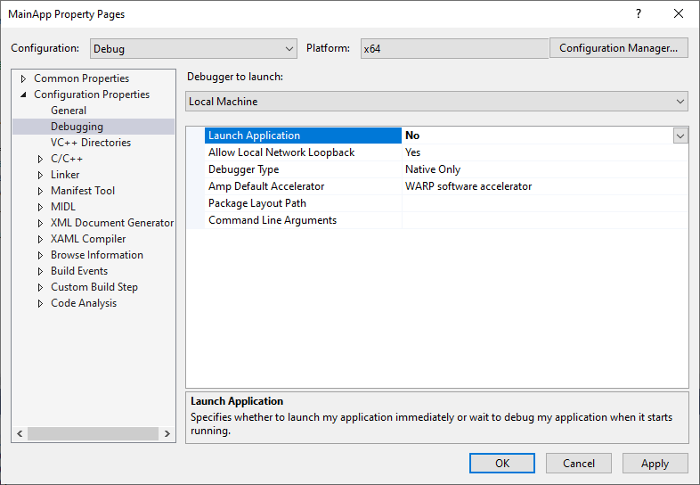
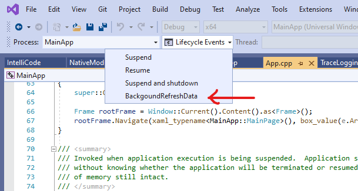

# React Native for Windows Background Tasks Sample

## Sample source: MainApp and NativeModule in BackgroundTaskSample

Open: ```react-native-windows\packages\microsoft-reactnative-sampleapps\windows\BackgroundTaskSample.sln```

Included projects:

```MainApp\MainApp.vcxproj```

```NativeModule\NativeModule.vcxproj```

## React Native for Windows - Background Tasks

## Windows Background Tasks

[React Native for Windows](https://microsoft.github.io/react-native-windows/) apps are [Universal Windows Platform](https://visualstudio.microsoft.com/vs/features/universal-windows-platform/) (UWP) applications and support the [UWP lifecycle events](https://docs.microsoft.com/en-us/windows/uwp/launch-resume/app-lifecycle) of Launch, Suspend and Resume. Additionally, this includes support for background tasks which are triggered by OS events. These triggers can be conditionally fired based on conditions such as available network or power state. This mechanism allows an app to process requests without displaying UI and are typically used for maintenance tasks or consumer scenarios like audio playback. Background tasks are foundational for the implementation of Windows [App Services](https://docs.microsoft.com/en-us/windows/uwp/launch-resume/how-to-create-and-consume-an-app-service).

## React Native Background Tasks

React Native includes a facility to register and process headless tasks. From the [React Native](https://reactnative.dev/blog/2016/10/25/0.36-headless-js-the-keyboard-api-and-more) documentation, "Headless JS is a way to run tasks in JavaScript while your app is in the background. It can be used, for example, to sync fresh data, handle push notifications, or play music."  This pattern is supported in React Native for Windows.

## Headless JS + Windows Background Tasks

Where Headless JS allows JavaScript to run while the application is in the background, Windows Background Tasks extends this by providing a way for Headless JS to be triggered and run, when the app is in the background or starting from a non-running state. The sample demonstrates how both native and JS code can be triggered and run in the background.

## Windows Background Task Triggers and Conditions

### Triggers

[Application Trigger](https://docs.microsoft.com/en-us/uwp/api/windows.applicationmodel.background.applicationtrigger?view=winrt-19041) : Very useful for development / testing. Allows the developer to explicitly trigger the background task from within the application. For example from a button press. (See testFireBackgroundTask in sample.)

[Time Trigger](https://docs.microsoft.com/en-us/uwp/api/windows.applicationmodel.background.timetrigger?view=winrt-19041) : Periodically runs task. Good for polling - should be avoided for mobile scenarios as it is consumes more battery power.

[System Event triggers e.g. Time zone changed](https://docs.microsoft.com/en-us/uwp/api/windows.applicationmodel.background.systemtriggertype?view=winrt-19041) : Used in  the sample to trigger the the background task.

### Conditions

You may need a background task to run under specific conditions, for example, only when the user is not interacting with their device, only when they have an internet connection, or only when they are connected to AC power. These conditions are specified as part of the background task registration. You may specify multiple conditions as required.

See here for a full list of [Windows triggers and conditions](https://docs.microsoft.com/en-us/uwp/api/windows.applicationmodel.background).

## Background Task Implementation

### App.cpp

#### App::OnBackgroundActivated

Sends a notification to the Native Module to run background JavaScript and Native code as needed. [IReactNotificationService SendNotification](https://microsoft.github.io/react-native-windows/docs/next/IReactNotificationService)
    
### Native Module

#### NativeModuleClass::Initialize

Sets up call back to receive the Notification sent from ```App.cpp``` when triggered by the registered background trigger. When the notification is received, it calls [```startHeadlessTask```](https://reactnative.dev/docs/headless-js-android) via [CallJSFunction](https://microsoft.github.io/react-native-windows/docs/ireactcontext-api)  to run the previously registered JS HeadlessTask including a call into the native module. See ```RunTask()``` in ```BackgroundTask.js```. This is to demonstrate native and JS tasks can be run when triggered.

#### Background Task Registration

Native and JS Background Task Registration at instance initialization. See ```RegisterTask()``` in ```index.windows.js``` and ```BackgroundTasks.js```. For implementation of native background task registration see ```RegisterNativeJsTaskHook()``` in ```NativeModuleClass.cpp```. 

Native Code: Register Conditions and Task with Windows Trigger ([BackgroundTaskBuilder](https://docs.microsoft.com/en-us/uwp/api/Windows.ApplicationModel.Background.BackgroundTaskBuilder?view=winrt-19041), [SetTrigger](https://docs.microsoft.com/en-us/uwp/api/windows.applicationmodel.background.backgroundtaskbuilder.settrigger))

See <a href='https://docs.microsoft.com/en-us/windows/uwp/launch-resume/register-a-background-task'>Register a background task - UWP applications | Microsoft Docs</a> for more information on background task registration in Windows.

See here for more information on headlesss JS: [```registerHeadlessTask startHeadlessTask```](https://reactnative.dev/docs/headless-js-android). See sample source files ```BackgroundTask.js``` and ```NativeModuleClass.cpp```.

### Sample Status

1. Task: Windows Background task registration. Status:  Completed.

Implemented in native module. Called when native module is loaded.

2. Task: Windows Background task test: Respond to an Application trigger which allows the application itself to trigger the background task. Implemented in the native module with UI button in JS.
Status:  Completed.

Note with this functionally any Windows specific tasks / APIs can be called.  If the APIs are implemented in the main application, no communication between the main app and native module is required.

3. Task: Signal Native Module when background task has triggered and execute headless Windows APIs in Native Module.
Status:  Completed.

The RNW team fixed this bug <a href='https://github.com/microsoft/react-native-windows/issues/6840'>ReactNotificationService does not send notifications from app to modules · Issue #6840 · microsoft/react-native-windows · GitHub</a> which was blocking the ability to send notifications from the main module to a native module.  

4. Task: Call JS background code when triggered by a Windows background trigger.
Status:  Completed.

Can call CallJSFunction to call registered JS background task or native background function in native module. 

5. Task: Test that the action occurs when the Background Event is triggered with application is in the:

Foreground -  Working

Background -  Working 

Background Suspended  -  Working

Not Running -  Not Working

The app should be able to complete its background task without having to display any UI. Status: Not completed. 

### Debugging the Background task

Note that you'll need to run the app at least once, it order to register the background task. The sample is register with the Time Zone changed trigger.

In order to trigger the task when app is not running add debug it you can use the feature in Visual Studio that allows you to start the Debugger, but not the app. 

See Project | Properties | Debugging

Change 'Launch Application' from **'Yes'** to **'No'**.


Set a breakpoint in ```App::OnBackgroundActivated()``` in ```App.cpp```.

Then Start the app with Debugging (F5). The debugger will start, but the app will not.

Now you need to **trigger the background task**. There are two ways to do this:

1) The name of the background task we registered is 'BackgroundRefreshData'. You can select this from the Life Cycle events menu in the Visual Studio toolbar:



2) Change the Time Zone settings in Windows. Search for 'Change the Time Zone' in the Start menu. Change to any time zone. Don't forget to change this back to your time zone!

Once triggered, the app will break where you set your breakpoint. Note that the UI of the app is not displayed. This is the expected behaviour as all code run in the background is UI-less by definition.

More information here: <a href='https://docs.microsoft.com/en-us/visualstudio/debugger/how-to-trigger-suspend-resume-and-background-events-for-windows-store-apps-in-visual-studio?view=vs-2019'>Trigger suspend/resume/background events when debugging UWP - Visual Studio | Microsoft Docs</a>


